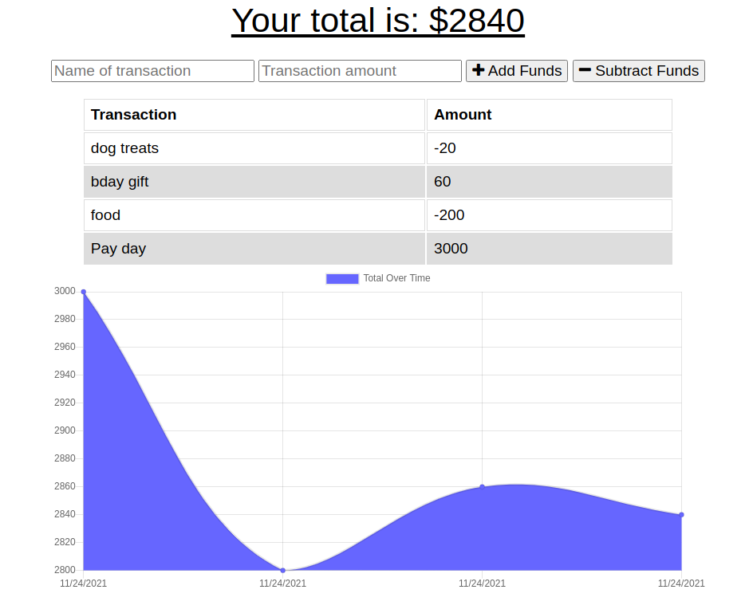

# Buget Tracker

## Table of Contents

* [Description](#description)
* [Screenshot](#screenshot)
* [Installation](#installation)
* [Usage](#usage)
* [License](#license)
* [Questions](#questions)

## Description

This app allows you to track your budget, even when you're offline! If transatcions are made offline, once you get back online, the app will 'bulk add' all the offline transactions. Also this is a Progressive Web App (PWA) meaning you can download the app straight to your phone or desktop without having to go to an app store!

## Screenshot

## Installation

The app is deployed live to [Heroku](https://budget-tracker-dlm.herokuapp.com/). 

To install the app directly to your device follow the steps below.

**Desktop**: 

After navigating to the web page in a Google Chome browser, click the download icon seen on the right side of the address bar. Next you'll see a `Install app` popup, click the install button. Done! you've now installed the app!

**iOS**: 

After navigating to the web page in a Safari browser, tap the share button, scroll down and tap the `Add to Home Screen`. Enter the name for the app then tap add. The PWA will show up on your home screen like a native iOS app.

**Android**:

After navigating to the web page in a Google Chome browser, tap the three-dot overflow menu in the top-right corner and then select ‘Add to home screen.’ Chrome will prompt you to enter a name for the app before adding it to your home screen.

## Usage

Track your budget by simply adding or subtracting funds. Enter the name of the transaction, the dollar amount and hit the `Add Fund` or `Subtract Funds`, which ever is appropriate. If you make tranactions while offline, simply refresh the app and the transactions will automatically get sent to the database.

## License

## Questions
Contact me at:
* [GitHub](https://github.com/murda02)
* [Email](mailto:davelmurphy@zoho.com)